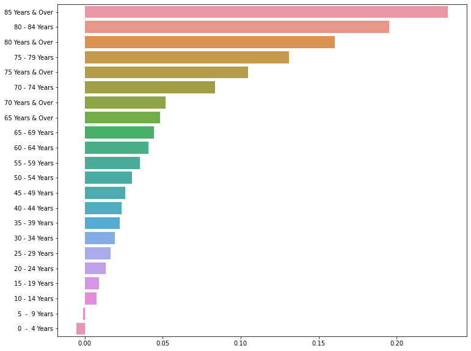

# GeoIQ_data_anlysist_assignment

##

## html file for Notebook 

Assignment  file:

part_1-EDA.ipynb

Notebook for part 1 

	1. Identify the largest Ethnic group in Singapore. Their average population growth over the
	years and what proportion of the total population do they constitute.
	2. Identify the largest age group in Singapore. Their average population growth over the
	years and what proportion of the total population do they constitute.
	3. Identify the group (by age, ethnicity and gender) that:
	a. Has shown the highest growth rate
	b. Has shown the lowest growth rate
	c. Has remained the same
	4. Plot a graph for population trends

part_2-latitude_longitude_info.ipynb

**Regex to parse similar pattern to following code snnipet**
~~~js
var marker_9795626cfd584471ab4406d756a00baf = L.marker(
    [19.041691972000024, 72.85052482000003],
    {}
).addTo(feature_group_ad623471194f451d9f1cf7fc718747c5);
~~~

it will be able to get the value for marker id, long, lat data 

and convert to csv file 

| marker_id  | latitude  | longitude  |  
|-----------|:-----------:|-----------:|  
| 9795626cfd584471ab4406d756a00baf | 19.041691972000024 | 72.85052482000003 |  
| 82a31b114c0243859e73c4f5f1332554	 | 19.047690380000063 | 72.85787174600006 second line of text | 
